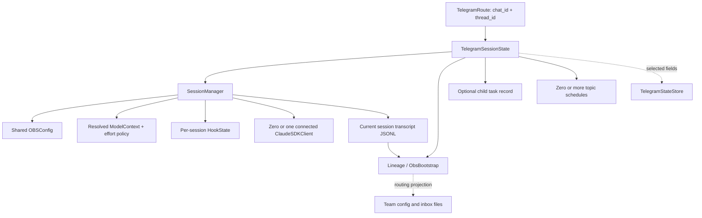

# Agent and session architecture

This is the implemented agent data model, reviewed against the Python source on
2026-09-16. It describes ownership and persistence, not a proposed replacement
schema or a guarantee about an upstream provider's capabilities. The human-facing
entry point is `/session` in Telegram and the CLI; the daemon exposes the same
read-only projection at `GET /session`.

## Start here: an agent is not just a session ID

An **agent** is a logical participant in a workflow. A **session** is its current
resumable Claude SDK conversation. A **client** is the live SDK/CLI process serving
that conversation. A **task** is one launch/lifecycle record for an agent-created
child. A **route** is the UI address (Telegram chat plus optional topic). These
identities often travel together, but they are not interchangeable.

The CLI/daemon owns a `SessionManager` and `HookState` directly, without a Telegram
route or child task record. Telegram creates a separate pair for each route.
Configuration is shared; model, effort, hooks and SDK environment can be selected
per session without mutating that shared configuration.

### Ownership map

| Concern | Implementation / source of truth | Lifetime |
| --- | --- | --- |
| UI route and topic metadata | [`TelegramRoute`, `TelegramSessionState`](../src/obs_agent/telegram.py) | Route can outlive conversations and process restarts. |
| Session ID, client, overrides, resume policy | [`SessionManager`](../src/obs_agent/session.py) | Manager can disconnect/reconnect the client while retaining the ID. |
| Machine/human names, ancestry, bootstrap | [`ObsBootstrap` and lineage helpers](../src/obs_agent/lineage.py) | Embedded in JSONL; pending/runtime copies and selected SQLite metadata. |
| Model identity and requested budget | [`ModelContext`, `resolve_model_context`](../src/obs_agent/config.py) | Derived from session selection or shared config. |
| Effective reasoning effort | [`resolve_effort`, `child_effort_override`](../src/obs_agent/effort.py) | Derived policy; explicit selection is session-local. |
| Queues, tool-boundary control, callbacks | [`HookState`, `create_hook_matchers`](../src/obs_agent/hooks.py) | Per-process runtime state, not a serialized SDK object. |
| Child task lifecycle | `_ForkTaskRecord` in [`telegram.py`](../src/obs_agent/telegram.py) | Optional; distinct from the child's resumable conversation. |
| Schedules | `_TopicScheduleRecord` and scheduler in [`telegram.py`](../src/obs_agent/telegram.py) | Route-owned; can trigger multiple runs. |
| Durable Telegram state | [`TelegramStateStore`](../src/obs_agent/telegram_state_store.py) | SQLite; reconstructs selected state, not the entire object graph. |
| Human-facing aggregate | [`SessionViewContext`, `build_session_info`](../src/obs_agent/session_info.py) | Read-only, on-demand projection; never another persistence authority. |

## Identity, naming and lineage

| Attribute | Meaning and important distinctions |
| --- | --- |
| `display_name` | Human lineage-node label; a child usually displays the leaf of its lineage. |
| `topic_title`, `topic_icon_custom_emoji_id` | Telegram presentation metadata. A topic title may differ from the canonical lineage label. Root display formatting may add the team timestamp. |
| `agent_name` | Machine/routing name. Root runtime names normally equal the root team key; child names combine a parent-lineage fingerprint and a slug. Use it with the team name, not as a globally unique ID. |
| `root_team_key` / `team_name` | Namespace for team membership and inbox routing. The normal root key has a UTC timestamp prefix plus a slug. Reading `/session` never generates a new key. |
| `lineage` / `agent_lineage` | Ordered human labels from root to current agent, not a sequence of SDK session UUIDs. |
| `parent_agent_name`, `parent_display_name` | Parent's logical identity. These are different from the parent conversation ID. |
| `origin`, `is_fork` | Bootstrap provenance and whether the session was forked rather than started fresh. |
| `session_id` | Current Claude SDK conversation ID, owned by `SessionManager`; mirrored into hook/runtime/result data. Usually becomes known at SDK init. |
| `agent_id` | **Still exists** as an optional bootstrap attribute. Agent-launched children commonly put the internal task UUID here. Not every route/manual fork has one. |
| `task_id` | Internal launch/task handle in `_ForkTaskRecord`. Do not replace `(team_name, agent_name)` addressing with it. A normal root session need not have a task record. |
| Native team `agentId` | Team-file compatibility identifier (often `agent@team`, including the synthetic team lead). It is not automatically the bootstrap `agent_id` or the SDK session ID. |
| `parent_session_id_at_launch` / bootstrap `parent_session_id` | Parent conversation at launch time; does not track subsequent parent resets. |
| `parent_source_uuid`, current head UUID | Message/checkpoint identifiers in a JSONL history. A UUID identifying a message is not a session ID. Telegram's `_session_heads` stores the current mapped head. |
| `chat_id`, `thread_id` | UI route identity. A missing thread identifies the non-topic route; it does not imply a missing session. |

The XML envelope is `<obs-bootstrap>` (currently serializer version 2), containing
lineage nodes, fork context and team context. It is queued before insertion using
`pending_obs_bootstrap` / `pending_obs_bootstrap_xml`. Readers can recover it from
user/system/queue entries in an existing JSONL. A fork can retain the original
history while appending bootstrap metadata for the new logical participant.

**There is no required, separate “lineage file.”** Normal lineage storage is the
bootstrap inside the transcript plus runtime/SQLite metadata. Team member `obs`
metadata is a routing projection, not a replacement transcript. Never fabricate a
`lineage.json` path in tooling or assume an unknown agent has a task UUID.

## Model, context and effort form a related configuration object

`ModelContext` is an immutable value with `model` (resolved clean ID),
`context_tokens`, and `explicit_context`. Its formatted model-with-context value
preserves the requested budget. Aliases, per-model context defaults and per-model
effort defaults live in `config.py`; they are harness configuration, not live
provider capability discovery.

| Layer | Resolution / responsibility |
| --- | --- |
| Selected model | `SessionManager.model_override` if set, otherwise `config.model`. `default_model` also participates in transport reset/selection policy. |
| Requested context window | Explicit suffix such as `[200k]`, otherwise the model registry/default resolver. It is independent of effort. |
| Effective effort | Explicit session override → session effort environment value → configured OBS effort → ambient effort environment value → model-specific default. |
| Explicit `auto` effort | Selects the model's default rather than falling through lower-priority explicit overrides; unlisted models can remain provider `auto`. |
| Provider routing | Local model path, Claude path, or proxy-compatible path, with endpoint/auth/cache-proxy handling in `_build_options`. The public view reports the family, not credentials or raw URLs. |
| Native CLI capacity / compaction | `ClaudeContextPlan` translates the requested budget into CLI-compatible capacity and compaction controls. This is **not** the budget displayed to users. |
| Actual supported effort | The harness sends the selection; the CLI/provider may validate, reject or clamp it. The display is not proof that a provider honored it. |

See [effort policy](effort.md), [context and compaction](context-compaction.md), and
[configuration](configuration.md) for the detailed knobs. For example, an OBS
400k budget can use a native 1m CLI selector to position compaction correctly;
it must still display as a 400k OBS budget. The optional earlier-compaction cap
and output-reserve policy also affect when compaction happens, not agent identity.

`/session` reports **one** context occupancy value, from the existing
`build_context_snapshot` / `format_context_snapshot_compact` path used by completion
notices. That path prefers the latest informative JSONL usage triplet (input plus
cache creation plus cache read), retains its zero-usage-tail/text fallback behavior,
and falls back to normalized result usage when needed. It is still an estimate,
not a billing total. Cumulative SDK counters, peak estimates, source comparison
lines and the optional external CLI probe are not part of this human view.

Before any usage exists the display says unavailable, rather than pretending it
has measured an empty context. A cold/restored model override supplies its own
budget even before options are built. Old result data carrying a different
session ID is not allowed to select the current view's transcript.

## Files and persistence

| Resource | Relationship to an agent |
| --- | --- |
| Session / transcript JSONL | Normally the **same file**, found through [`find_session_jsonl`](../src/obs_agent/context_jsonl.py). Typical layout is `~/.claude/projects/<encoded-workspace>/<session-id>.jsonl`; lookup also handles existing project locations. Show a discovered path, not an invented one. |
| Bootstrap lineage | XML embedded in the JSONL, with pending/runtime copies before insertion. |
| Telegram state database | `config.telegram_state_db_path`; selected route/model/effort/hook/lineage metadata, task/schedule/mapping records live in SQLite. This is not the SDK transcript. |
| Team config and inboxes | Team membership and file-based messaging projections under the team helpers' configured/conventional locations. Member `obs` metadata connects names/lineage/routes. Inspect the helpers rather than inferring identity solely from a filename. |
| Working directory / project | `config.vault_path`, used as SDK `cwd` and for relative hook/prompt/settings resolution. |
| Entry file | `config.context_path` (`agent_entry_file`, normally `CLAUDE.md`). Its content is persisted into the first user turn using an entry-file sentinel, then inherited by transcript forks. |
| Project settings | `config.claude_path / "settings.json"`; project settings and session defaults can influence hooks/environment/scheduling. The listed path is a configuration location, not a claim the file exists. |
| Task prompt file | Optional `prompt_file` plus resolved `prompt_file_content` at launch; separate from the conversation transcript. Prompt content is deliberately not dumped by `/session`. |
| Temporary attachments, logs, reports | Runtime/transport resources, not another canonical agent record. Telegram temp root, retention, inbound normalization and observability settings affect these resources. |

`_persist_state_for_route` explicitly saves session ID, topic name/icon, child
naming counters, completion notifications, last inbound mapping, lineage, pending
bootstrap, model override, serialized user hooks and effort override. Restore
recreates runtime objects and rebinds callbacks; it does not deserialize a live
SDK process or Python coroutine.

General per-session **SDK environment overrides are not serialized as a complete
map** by that route persistence method. Identity fields are reconstructed and
an explicit effort selection has dedicated persistence, but arbitrary provider
parameters are not therefore guaranteed to survive a process restart. Treat
restart survival as field-specific, not “the entire agent object is saved.”

## Session/client lifecycle and launch inheritance

`SessionManager` stores `session_id`, `last_activity`, model/effort overrides,
`user_hooks`, the SDK environment group, pending entry-file injection, and the
private client/connection/lock state. `has_connected_client()` and `should_resume()`
answer different questions: a disconnected client can still have a resumable
conversation. Resume eligibility uses a **strictly less than** cache-window check.

A normal turn reuses an eligible connected client; lazy reconnection may recreate
it. Disconnecting/reclaiming an idle process does not by itself erase the
conversation. Explicit reset clears the conversation ID/activity. Telegram's
`/clear` and `/new` implement different identity behavior on top of that lifecycle;
model/effort selection is retained by their transport policy. JSONL repair can
safe-fork into a new session ID while keeping the logical agent/route. Thus neither
“new process = new agent” nor “same topic = same session ID forever” is true.

| Child launch input | Current behavior |
| --- | --- |
| `prompt`, optional `prompt_file`, `display_name`, description | Establish work and presentation/bootstrap context. |
| `fork` / source message | Fork copies the selected transcript prefix; a fresh child starts a new conversation. Cross-model changes require the supported fresh-child path rather than assuming any transcript can be resumed with any model. |
| Model | Inherited unless explicitly selected; each child receives its own manager override. |
| Effort | With inherited model, omitted effort inherits parent effective effort. An explicitly selected model uses its own defaults; `inherit` explicitly copies parent effort and `auto` requests the model default. |
| `env`, `temperature` | Per-child SDK/provider parameter group. Temperature is merged into the provider body and disables adaptive thinking on that path. Values are not included in `/session`. |
| `user_hooks`, `inherit_hooks` | Explicit event/spec map or opt-in parent hook inheritance. Current default for inheritance is false. |
| `inherit_schedules` | Defaults true on the Telegram launch path, subject to each schedule's inheritance policy. |
| `timeout_ms`, `max_turns` | Child execution limits, distinct from the model's context budget and the session cache window. |
| Resume / inbox wake | Can activate the existing child/task. Does not imply a new logical agent; effort changes use the idle `/effort` path. |

See [`AgentTask` parsing](../src/obs_agent/tools.py),
[`_spawn_forked_topic` and `_launch_fork_task`](../src/obs_agent/telegram.py), and
[`ConversationRunner`](../src/obs_agent/runner.py) for the executable boundaries.

## Hooks and SDK/environment parameters

There is one supported built-in pipeline for each of these events; each applies
without a tool-name matcher restriction:

| Event | Ordered behavior |
| --- | --- |
| `PreToolUse` | Interrupt check → native/immutable guard → tool state → optional user check. |
| `PostToolUse` | Tool state → optional user check → **queue delivery last**. |
| `Notification`, `SubagentStart`, `SubagentStop` | Notification handling → optional event-specific user check. |
| `Stop` | Stop handling → optional user check. |

The current public user-hook shape is `dict[event_name, "file_path::function"]`:
one configured spec per event, **not** an arbitrary list of user hooks per event.
Relative files resolve against the vault. Loading failures are logged and skipped.
An unrecognized event key does not automatically add a new SDK event pipeline.
The view therefore labels hooks **configured**, not “successfully loaded.” Reading
metadata never imports these files or invokes their functions.

Group environment and SDK options as a parameter bundle:

| Parameter group | Effect |
| --- | --- |
| Shared configuration | Project paths, model/defaults, cache/resume window, queue-continuation limit, background-fork timeout, SDK buffer size, compaction policy, idle-process reclamation and fork-cache warmup. |
| Project and prompt configuration | Project setting sources plus the `claude_code` preset; persisted entry-file context; markdown procedures and skills are project content, not fields on the SDK client. |
| Permissions and tools | Currently `bypassPermissions`; an in-process `obs-agent` MCP server exposing harness tools plus the SDK's configured/native tools. This is a consequential execution policy, not a harmless display setting. |
| SDK environment bundle | Harness defaults, per-session overrides, inherited process environment, generated model/context/effort settings, provider routing/auth and optional cache proxy. Precedence is policy-specific; it is not one universal last-write-wins map. |
| Provider parameters | Endpoint/authentication, extra request body, temperature/thinking/output controls. Keep raw values and credentials out of routine session output. |
| Transport configuration | Telegram identity/allowlist/bot selection, rate/typing controls, state retention, attachment/transcription handling; daemon host/port for CLI. These influence delivery and persistence, not just the model. |

`_build_options` is **not a getter**: it assembles the MCP server, loads hooks,
updates hook state and produces new `ClaudeAgentOptions`. Environment changes are
applied to newly built clients, not magically to a running process. `/session`
reads selected configuration and client presence; it is not a live dump of the
subprocess's effective environment. Managed SDK controls are also supplied through
inline settings where needed to prevent project settings undoing context/effort
policy. Authentication handling is provider-specific; consult `session.py` before
changing it.

## Runtime attributes that are easy to miss

These are part of the model even where the default UI summarizes them:

| Owner | Attribute groups |
| --- | --- |
| `HookState`: messaging | `message_queue`, `status_queue`, `pause_queue_delivery`; interrupt flag/request/notice state. Queue entries can be structured `QueuedMessage` objects. Reading info must not drain them. |
| `HookState`: execution | `execution_active`, `current_tool_use_id`, `background_tasks`, `last_result_data` (usage, cost, turn/duration data), mirrored session/model/vault/environment. |
| `HookState`: scheduling/bootstrap | `schedule_run_active`, `triggered_schedule_id`, `active_schedule`, `pending_obs_bootstrap_xml`. |
| `HookState`: capabilities | Fork launch/output/stop callbacks; cron create/list/delete callbacks; inbox validation/notification; stop notification; context and team-status providers. These are runtime bindings, not portable serialized callables. |
| `TelegramSessionState`: coordination | `busy`, `pending_messages`, `last_bot`, `active_fork_task_ids`, `notify_on_completion`; context warning latch. |
| `TelegramSessionState`: naming/wake | `child_fork_count`, `child_fork_base_title`, lineage/pending bootstrap; pending inbox wake and sender/summary/content. |
| `_ForkTaskRecord`: lifecycle | Task/parent/child/source IDs and routes, status, created/completed times, launch tool name, `is_fork`, result/error/terminal request, timeout/turn limits. |
| `_ForkTaskRecord`: delivery/accounting | Parent/child launch/completion/callback message IDs, tool-use ID, usage token/tool/duration counters, `emit_parent_callback`, `idle_ready`, `wake_requested` and wake sender/summary/content. |
| `_TopicScheduleRecord` | Schedule ID/route, description/prompt, mode/trigger/cron/interval, reset/recurring/enabled, run count/limit, time bounds, inheritance mode, next/last/success times, errors and retry policy/count. |
| Transport indexes | Route↔session and task mappings, session heads, Telegram message↔JSONL bindings, schedule-by-route and active-execution indexes, team worker routing. These connect the entities; they are not extra globally unique agent IDs. |

Full message bodies, task prompts/results and schedule prompts are intentionally
excluded from the public info projection. Runtime counters/flags and hook specs
are enough for the overview without turning `/session` into a transcript dump.

## `/session` contract and architecture review

The view is grouped into **Agent**, **Session**, **Model & context**, **Files**,
**Runtime & parameters**, and **Hooks**. Absent metadata is shown as absent or
omitted, not inferred from invented timestamps or UUIDs. The command accepts no
arguments. Telegram enforces the existing allowlist, splits long output into
plain-text messages, and can inspect active or cold routes without persisting a
new route or seeding a schedule. CLI supports it both at the prompt and while a
response streams; `GET /session` does not acquire a turn lock or start a client.

OBS `/context` is removed from handlers, help and the Telegram menu. The native
Claude CLI `/context` and the agent-facing MCP `context_info` / `session_info`
diagnostic tools are separate interfaces and are not removed by this change.
The CLI-probe setting no longer makes this human-facing command launch a probe.

### Findings and boundaries

| Finding | Resolution / remaining boundary |
| --- | --- |
| Agent attributes were scattered across several owners. | Document the aggregate and expose one read-only projection; do not introduce another mutable copy of agent state. |
| Context UI mixed occupancy, billing totals and alternative estimates. | Keep the existing primary context summary only. Core usage/compaction code and diagnostic tools remain available. |
| Cold/restored model override used a global fallback window. | Shared window selection now resolves that override before the first SDK turn; completion and session views use the same helper. |
| Introspection could create route/schedule state or start a CLI probe. | The new handlers are non-mutating and do not build options, load hooks, probe or connect. |
| Old result data could point inspection at another session after reset/recovery. | The projection ignores result data explicitly belonging to a different session ID. |
| Environment persistence is partial. | Documented, **not redesigned** here. A future durable parameter schema should explicitly allowlist safe values and define credential references. |
| Hook configuration is not proof of activation. | Label it as configured. A future loaded-hook status model could record success/failure without executing anything during inspection. |
| Hook inheritance has edge cases. | Current spawn code uses a falsy test (`if not effective_hooks and inherit_hooks`) and can share the parent's mapping. Empty-map disabling and defensive copying remain review items, not behavior changes hidden in this UI patch. |
| Requested configuration differs from a running subprocess's actual state. | Report selection and connected/resumable status honestly. A future immutable last-built-options summary could expose safe applied-state metadata. |

### Regression coverage

[`test_session_info.py`](../tests/test_session_info.py) covers cold and active
sessions, identity/lineage, transcript-backed context/fallbacks, corrupt/missing
files, stale-result IDs, model-window overrides, environment redaction, hook
inventory/no execution, command registration, authorization, long plain-text
output, daemon inspection and CLI routing. Existing effort restoration and live
scenario *definitions* are updated to the new command name. The latter are not
permission to run live scenarios.

The read-only session CI lane uses locked dependencies and explicit offline unit
files, alongside existing context/effort regression workflows. Offline CI does
not establish live-provider compatibility, Telegram production behavior, or the
formal isolated-service protocol described in [testing.md](testing.md).
